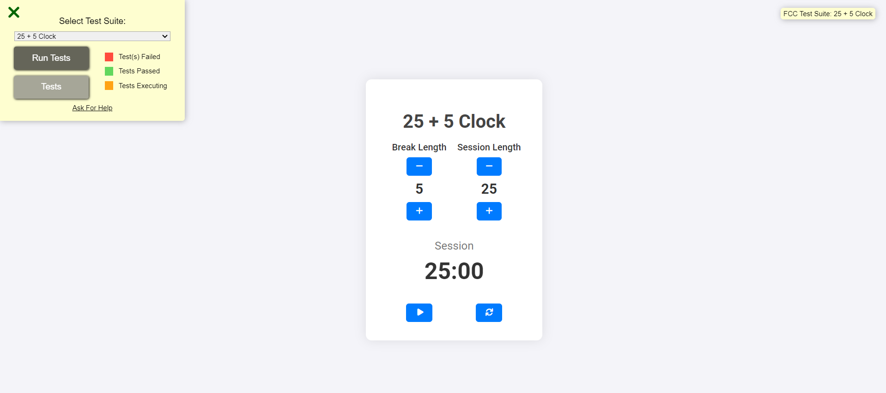

# 25 + 5 Clock

A Pomodoro timer application built using React and Vite. The application fulfills all the user stories outlined by freeCodeCamp.



## Demo

You can view a live demo of the 25 + 5 Clock [here](https://javascript-clock.hackimtech.com/).

## Features

- Adjustable session and break lengths.
- Start, pause, and reset functionality.
- Countdown timer display.
- Automatic transition between session and break periods.
- Audible alarm when timer reaches zero.

## Installation

To run this project locally, follow these steps:

1. Clone the repository:

   ```bash
   git clone https://github.com/hackim18/Frontend-JavaScript-Clock
   cd Frontend-JavaScript-Clock
   ```

2. Install dependencies:

   ```bash
   npm install
   ```

3. Start the development server:

   ```bash
   npm run dev
   ```

4. Open your browser and navigate to http://localhost:3000.

## Usage

- Use the "+" and "-" buttons to adjust the session and break lengths.
- Click the "Start/Stop" button to start or pause the timer.
- Click the "Reset" button to reset the timer to the default state.

## Technologies Used

- React
- Vite
- JavaScript
- HTML/CSS

## User Stories

1. Display Elements

   - The application has an element with id="break-label" that contains the string "Break Length".
   - The application has an element with id="session-label" that contains the string "Session Length".

2. Increment and Decrement Buttons

   - The application has clickable elements with IDs "break-decrement" and "session-decrement".
   - The application has clickable elements with IDs "break-increment" and "session-increment".

3. Initial Values

   - The element with id="break-length" displays a value of 5.
   - The element with id="session-length" displays a value of 25.

4. Timer Display

   - The application has an element with id="timer-label" indicating the timer's status (Session/Break).
   - The element with id="time-left" displays the timer in mm format.

5. Control Buttons

   - The application has a clickable element with id="start_stop".
   - The application has a clickable element with id="reset".

6. Timer Functionality

   - The timer starts from the session length and decrements every second.
   - When the session countdown reaches zero, the timer switches to the break countdown.
   - When the break countdown reaches zero, the timer switches back to the session countdown.
   - The element with id="timer-label" switches between "Session" and "Break" appropriately.
   - The application plays a sound when the timer reaches zero.

7. Reset Functionality
   - Clicking the reset button stops the timer, resets the session and break lengths to their default values, and clears the timer display.

## Credits

Project inspired by FreeCodeCamp 25 + 5 Clock project.

## License

This project is licensed under the MIT License - see the LICENSE file for details.
